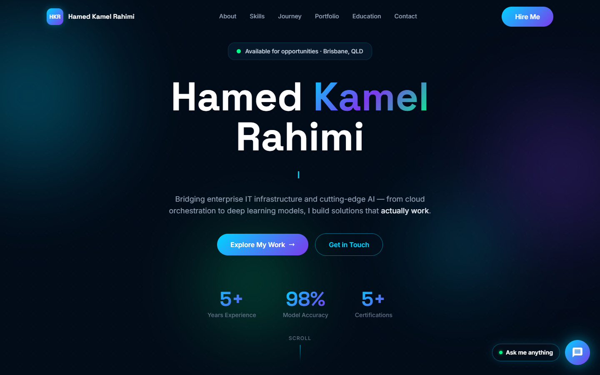

<div align="center">

# Hamed Kamel Rahimi — Portfolio

**IT Specialist · AI & Automation Enthusiast · Greater Brisbane, QLD**

[](https://nextjs.org)
[](https://www.typescriptlang.org)
[](https://tailwindcss.com)
[](LICENSE)

[Live Demo](https://portfolio-jade-omega-5owes53s9t.vercel.app) · [Report Bug](https://github.com/hamedkamelr/portfolio/issues) · [Contact](mailto:hamed.kamel35@gmail.com)



</div>

---

## Overview

A modern, single-page portfolio website with an **enterprise meets edgy** design — dark navy background, electric cyan/purple gradient accents, glassmorphism cards, and scroll-triggered animations.

Built with **Next.js 14 App Router**, fully typed with **TypeScript**, and styled with **Tailwind CSS**. Includes a fully local AI chatbot that runs in the browser with no API key required.

---

## Features

- **Responsive design** — works on mobile, tablet, and desktop
- **Typing animation** — hero section cycles through roles with a blinking cursor
- **Scroll reveal** — elements animate into view as you scroll
- **Tabbed skills browser** — organised into Cloud, AI/ML, Data Analytics, IT Ops
- **Interactive timeline** — alternating career cards with colour-coded indicators
- **Project showcase** — 3-column card grid with gradient headers and status badges
- **Local AI chatbot** — keyword-matching assistant, no API key, no internet required
- **Optional AI upgrade** — drop in an Anthropic API key to upgrade to streaming LLM responses
- **Zero external dependencies** — runs entirely offline once installed

---

## Tech Stack

| Layer | Technology |
|---|---|
| Framework | Next.js 14 (App Router) |
| Language | TypeScript 5 |
| Styling | Tailwind CSS 3.4 + custom CSS animations |
| Fonts | Space Grotesk · Inter (Google Fonts) |
| AI (optional) | Anthropic API via `@anthropic-ai/sdk` |

---

## Getting Started

### Prerequisites

- Node.js **v18+** — [nodejs.org](https://nodejs.org)

### Installation

```bash
# 1. Clone the repo
git clone https://github.com/hamedkamelr/portfolio.git
cd portfolio

# 2. Install dependencies
npm install

# 3. Start the development server
npm run dev
```

Or visit the live site: **[https://portfolio-jade-omega-5owes53s9t.vercel.app](https://portfolio-jade-omega-5owes53s9t.vercel.app)**

For local development, open [http://localhost:3003](http://localhost:3003) in your browser.

---

## Project Structure

```
app/
├── layout.tsx              # Root layout, metadata, Google Fonts
├── page.tsx                # Main page — imports all sections
├── globals.css             # Design tokens, animations, utility classes
├── api/chat/route.ts       # Optional: AI streaming endpoint
└── components/
    ├── Navigation.tsx      # Fixed top bar with smooth-scroll links
    ├── Hero.tsx            # Full-screen hero with typing animation
    ├── About.tsx           # Bio and highlight cards
    ├── Skills.tsx          # Tabbed skill categories
    ├── Timeline.tsx        # Career journey timeline
    ├── Portfolio.tsx       # Project showcase grid
    ├── Education.tsx       # Degrees and certifications
    ├── Contact.tsx         # Contact info and footer
    └── Chatbot.tsx         # Floating AI assistant widget
```

---

## Chatbot

The chatbot runs **entirely in the browser** — no server, no API key, no internet connection required.

It uses a keyword-scoring engine with 20 intent categories covering:
current role, experience, skills, AI projects, Azure/cloud, Power BI, education, certifications, contact info, publications, and more.

### Upgrading to AI (optional)

1. Get an API key from [console.anthropic.com](https://console.anthropic.com)
2. Create `.env.local` in the project root:
   ```
   ANTHROPIC_API_KEY=sk-ant-your-key-here
   ```
3. Restart the dev server — the `/api/chat` route activates automatically

---

## Customisation

| What to change | File |
|---|---|
| Name, tagline, roles | `app/components/Hero.tsx` |
| Bio and highlights | `app/components/About.tsx` |
| Skills | `app/components/Skills.tsx` |
| Career history | `app/components/Timeline.tsx` |
| Projects | `app/components/Portfolio.tsx` |
| Education & certs | `app/components/Education.tsx` |
| Contact details | `app/components/Contact.tsx` |
| Chatbot knowledge | `app/components/Chatbot.tsx` → `KB` object |
| Colours & animations | `app/globals.css` |
| Page title & SEO | `app/layout.tsx` |

---

## Deployment

### Vercel (recommended)

[](https://vercel.com/new/clone?repository-url=https://github.com/hamedkamelr/portfolio)

1. Click the button above or import the repo at [vercel.com/new](https://vercel.com/new)
2. Add `ANTHROPIC_API_KEY` in environment variables (optional)
3. Deploy — no configuration needed

### Static Export

For GitHub Pages, Netlify, or Cloudflare Pages (local chatbot only):

```js
// next.config.js
const nextConfig = { output: 'export' }
module.exports = nextConfig
```

```bash
npm run build   # generates the 'out/' folder
```

---

## License

MIT — see [LICENSE](LICENSE) for details.

---

<div align="center">

Built by [Hamed Kamel Rahimi](https://www.linkedin.com/in/hamedkamel) · [hamed.kamel35@gmail.com](mailto:hamed.kamel35@gmail.com)

</div>
